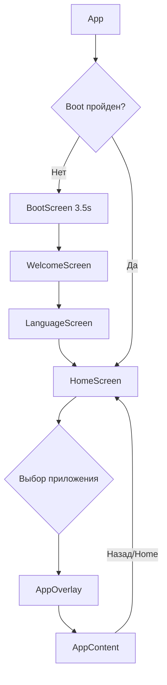

# План: Новый интерфейс SpidiPhone на React и Kotlin

## Обзор

Переписать PC-версию с vanilla HTML/CSS/JS на **React + TypeScript** и обновить/улучшить Android-версию на **Kotlin + Jetpack Compose**, используя существующие иконки пользователя.

---

## Часть 1: React PC-версия (spidiphone-pc/)

### Стек технологий
- **Vite + React 18 + TypeScript**
- **CSS Modules** или **Tailwind CSS** для стилей
- **React Router** для навигации между экранами
- Сохранение всех существующих ассетов (иконки)

### Архитектура компонентов

```
spidiphone-pc/
├── src/
│   ├── components/
│   │   ├── DeviceFrame.tsx          // Внешняя рамка телефона
│   │   ├── StatusBar.tsx            // Статус-бар (время, батарея, wifi)
│   │   ├── AppGrid.tsx              // Сетка иконок приложений
│   │   ├── AppIcon.tsx              // Одна иконка приложения
│   │   ├── DockBar.tsx              // Нижняя панель (док)
│   │   ├── DockItem.tsx             // Элемент дока
│   │   ├── HomeIndicator.tsx        // Индикатор home
│   │   ├── AppOverlay.tsx           // Оверлей открытого приложения
│   │   ├── AppContent.tsx           // Контент приложения
│   │   └── WidgetArea.tsx           // Виджеты погоды/календаря
│   │
│   ├── screens/
│   │   ├── BootScreen.tsx           // Загрузочный экран
│   │   ├── WelcomeScreen.tsx        // Экран приветствия
│   │   ├── LanguageScreen.tsx       // Выбор языка
│   │   ├── HomeScreen.tsx           // Главный экран (home)
│   │   ├── SetupScreen.tsx          // Экран первоначальной настройки
│   │   │   ├── RegionStep.tsx       // Шаг выбора региона
│   │   │   ├── ThemeStep.tsx        // Шаг выбора темы
│   │   │   ├── InstallStep.tsx      // Шаг установки приложений
│   │   │   └── CompleteStep.tsx     // Завершение настройки
│   │
│   ├── apps/
│   │   ├── MessagesApp.tsx          // Приложение "Сообщения"
│   │   ├── PhoneApp.tsx             // Приложение "Звонки"
│   │   ├── CameraApp.tsx            // Приложение "Камера"
│   │   ├── GalleryApp.tsx           // Приложение "Галерея"
│   │   ├── MusicApp.tsx             // Приложение "Музыка"
│   │   ├── MapsApp.tsx              // Приложение "Карты"
│   │   ├── NotesApp.tsx             // Приложение "Заметки"
│   │   ├── SettingsApp.tsx          // Приложение "Настройки"
│   │   └── BrowserApp.tsx           // Приложение "Браузер"
│   │
│   ├── hooks/
│   │   ├── useTime.ts               // Хук для обновления времени
│   │   └── useLocalStorage.ts       // Хук для localStorage
│   │
│   ├── data/
│   │   ├── apps.ts                  // Список всех приложений
│   │   └── languages.ts             // Языки
│   │
│   ├── types/
│   │   └── index.ts                 // TypeScript типы
│   │
│   ├── styles/
│   │   └── global.css               // Глобальные стили
│   │
│   ├── App.tsx                      // Корневой компонент
│   ├── main.tsx                     // Точка входа
│   └── vite-env.d.ts
│
├── public/
│   ├── photo_for_Zapusk.png
│   └── assets/                      // Иконки (остаются как есть)
│
├── index.html
├── package.json
├── tsconfig.json
├── vite.config.ts
└── README.md
```

### Поток навигации



### Ключевые улучшения дизайна
- **Glassmorphism** — эффект стекла для дока и оверлеев
- **Neumorphism** — мягкие тени для иконок
- **Плавные анимации** переходов между экранами
- **Адаптивность** — поддержка разных размеров экрана
- **Тёмная и светлая темы**
- **iOS-style blur** в статус-баре и доке
- Улучшенные виджеты погоды и календаря

---

## Часть 2: Обновлённая Kotlin Android-версия (spidiphone-mobile/)

### Улучшения кода
- **Рефакторинг** — разбить `MainActivity.kt` на отдельные файлы по компонентам
- **Material 3** — использовать актуальные компоненты Material Design 3
- **Анимации** — добавить плавные переходы между экранами
- **Добавить недостающие приложения** — Музыка, Карты, Заметки, Браузер

### Новая структура файлов

```
java/com/spidiphone/
├── MainActivity.kt                    // Только точка входа
├── model/
│   ├── App.kt                         // Data class App
│   └── SetupScreen.kt                 // Enum SetupScreen
├── data/
│   └── AppData.kt                     // Список приложений
├── ui/
│   ├── components/
│   │   ├── StatusBar.kt               // Статус-бар
│   │   ├── AppIcon.kt                 // Иконка приложения
│   │   ├── AppGrid.kt                 // Сетка приложений
│   │   ├── DockBar.kt                 // Нижняя панель
│   │   ├── HomeIndicator.kt           // Индикатор home
│   │   └── AppDialog.kt               // Диалог открытого приложения
│   ├── screens/
│   │   ├── BootScreen.kt              // Загрузочный экран
│   │   ├── WelcomeScreen.kt           // Приветствие
│   │   ├── LanguageScreen.kt          // Выбор языка
│   │   ├── HomeScreen.kt              // Главный экран
│   │   ├── setup/
│   │   │   ├── RegionScreen.kt        // Выбор региона
│   │   │   ├── ThemeScreen.kt         // Выбор темы
│   │   │   ├── InstallScreen.kt       // Установка
│   │   │   └── CompleteScreen.kt      // Завершение
│   │   └── apps/
│   │       ├── MessagesApp.kt         // Сообщения
│   │       ├── PhoneApp.kt            // Звонки
│   │       ├── CameraApp.kt           // Камера
│   │       ├── GalleryApp.kt          // Галерея
│   │       ├── MusicApp.kt            // Музыка
│   │       ├── MapsApp.kt             // Карты
│   │       ├── NotesApp.kt            // Заметки
│   │       ├── SettingsApp.kt         // Настройки
│   │       └── BrowserApp.kt          // Браузер
│   └── theme/
│       └── Theme.kt                   // Тема приложения
```

### Ключевые улучшения
- **Material 3 Dynamic Colors** (Android 12+)
- **Анимации Lottie** для загрузки
- **Pull-to-refresh** и скролл в приложениях
- **Edge-to-edge immersive mode**
- **Better navigation** с Jetpack Navigation Compose
- Поддержка планшетов (адаптивная сетка)

---

## Пошаговый план реализации

### Шаг 1: React PC-версия
1. Инициализировать Vite + React + TypeScript проект
2. Настроить структуру компонентов
3. Перенести ассеты (иконки) в новую структуру
4. Реализовать DeviceFrame и StatusBar
5. Реализовать BootScreen, WelcomeScreen, LanguageScreen
6. Реализовать HomeScreen с AppGrid, DockBar, WidgetArea
7. Реализовать AppOverlay с динамическим контентом
8. Реализовать каждое приложение (8-9 шт)
9. Добавить анимации и улучшения дизайна
10. Настроить localStorage для сохранения состояния
11. Добавить поддержку тем (светлая/тёмная)

### Шаг 2: Kotlin Android-версия
1. Рефакторинг MainActivity.kt (разбить на модули)
2. Создать model/App.kt, model/SetupScreen.kt
3. Создать data/AppData.kt
4. Создать ui/components/ (StatusBar, AppIcon, AppGrid и т.д.)
5. Создать ui/screens/ (BootScreen, HomeScreen и т.д.)
6. Создать ui/screens/apps/ (каждое приложение отдельно)
7. Разделить setup flow (RegionScreen, ThemeScreen и т.д.)
8. Добавить анимации и Material 3
9. Поддержка светлой/тёмной темы
10. Добавить недостающие приложения (Music, Maps, Notes, Browser)

---

## Важные вопросы перед реализацией

1. **Уровень навыков React** — нужен ли простой React или с TypeScript?
2. **Тип стилей** — CSS Modules, Tailwind CSS, или styled-components?
3. **Иконки** — все иконки уже в папке assets, нужно ли что-то менять?
4. **Android-версия** — обновлять до последней версии Compose BOM?
5. **Эмуляция телефона** — оставить тот же форм-фактор 375x812px?